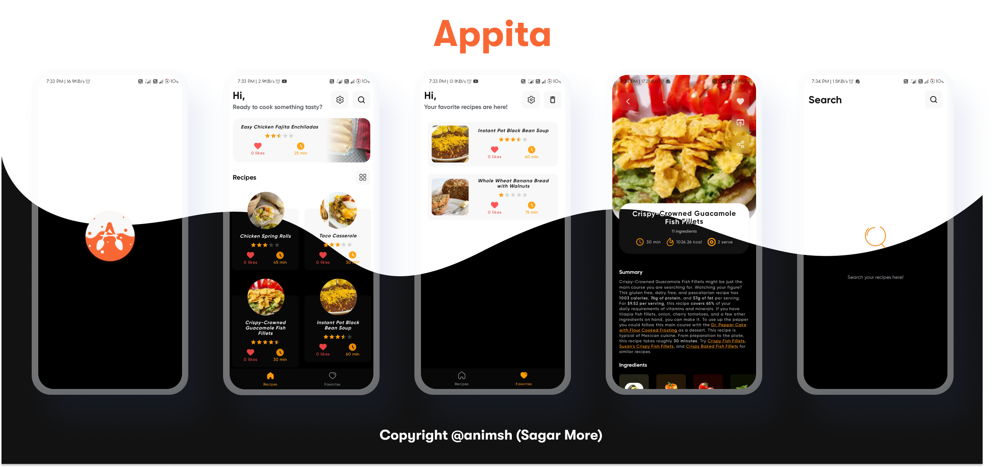
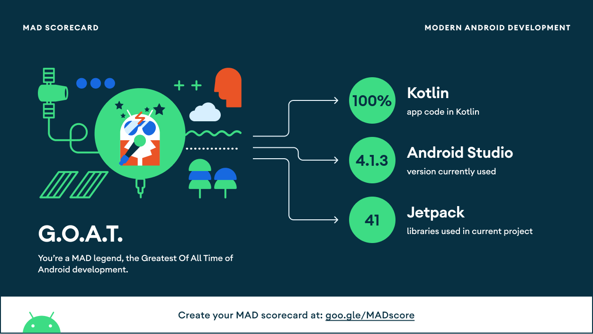

<p align="center">

<h1 align="center">Appita - Food Recipes App</h1>
</p>

<p align="center">
  <a href="https://opensource.org/licenses/Apache-2.0"></a>
  <a href="https://android-arsenal.com/api?level=24"></a>
  <a href="https://github.com/animsh"></a>
</p>

<p align="center">  
Appita is a small demo application based on modern Android application tech-stacks.
</br>

<p align="center">

</p>

## Download

Go to the [Releases](https://github.com/animsh/Appita/releases) to download the latest APK.


## Tech stack & Open-source libraries

- Minimum SDK level 24
- [Kotlin](https://kotlinlang.org/) based, [Coroutines](https://github.com/Kotlin/kotlinx.coroutines) + [Flow](https://kotlin.github.io/kotlinx.coroutines/kotlinx-coroutines-core/kotlinx.coroutines.flow/) for asynchronous.
- Hilt (alpha) for dependency injection.
- JetPack
  - LiveData - notify domain layer data to views.
  - Lifecycle - dispose of observing data when lifecycle state changes.
  - ViewModel - UI related data holder, lifecycle aware.
  - Room Persistence - construct a database using the abstract layer.
- Architecture
  - MVVM Architecture (View - DataBinding - ViewModel - Model)
  - Repository pattern
- [Retrofit2 & OkHttp3](https://github.com/square/retrofit) - construct the REST APIs and paging network data.
- [Gson](https://github.com/square/gson/) - A modern JSON library for Kotlin and Java.
- [Glide](https://github.com/bumptech/glide) - loading images.
- [Material-Components](https://github.com/material-components/material-components-android) - Material design components like ripple animation, cardView.
- Custom Views

  - [ShimmerRecyclerView](https://github.com/omtodkar/ShimmerRecyclerView) - A custom Shimmer RecyclerView which adopt to list / grid transition automatically and also supports multiple view types while shimmering..
  - [RoundedImageView](https://github.com/vinc3m1/RoundedImageView) - A fast ImageView that supports rounded corners, ovals, and circles.
  - [RealtimeBlurView](https://github.com/mmin18/RealtimeBlurView) - A realtime blurring overlay for Android (like iOS UIVisualEffectView).
  - [LottieFiles](https://lottiefiles.com/blog/working-with-lottie/getting-started-with-lottie-animations-in-android-app) - Display lightweight, scalable, and interactive Lottie animations on your websites and apps.

  ## MAD Score

  
  

## Architecture

Appita is based on MVVM architecture and a repository pattern.


## Open API


Appita (Recipes App) using the [Spoonacular API](https://spoonacular.com/food-api) for constructing RESTful API.<br>
Spoonacular API provides a RESTful API interface to highly detailed objects built from thousands of lines of data related to Recipes.

## Find this repository useful? :heart:

Support it by joining **[stargazers](https://github.com/animsh/Appita/stargazers)** for this repository. :star: <br>
And **[follow](https://github.com/animsh)** me for my next creations! 🤩

# License

```xml
Designed and developed by 2021 animsh (Sagar More)

Licensed under the Apache License, Version 2.0 (the "License");
you may not use this file except in compliance with the License.
You may obtain a copy of the License at

   http://www.apache.org/licenses/LICENSE-2.0

Unless required by applicable law or agreed to in writing, software
distributed under the License is distributed on an "AS IS" BASIS,
WITHOUT WARRANTIES OR CONDITIONS OF ANY KIND, either express or implied.
See the License for the specific language governing permissions and
limitations under the License.
```
